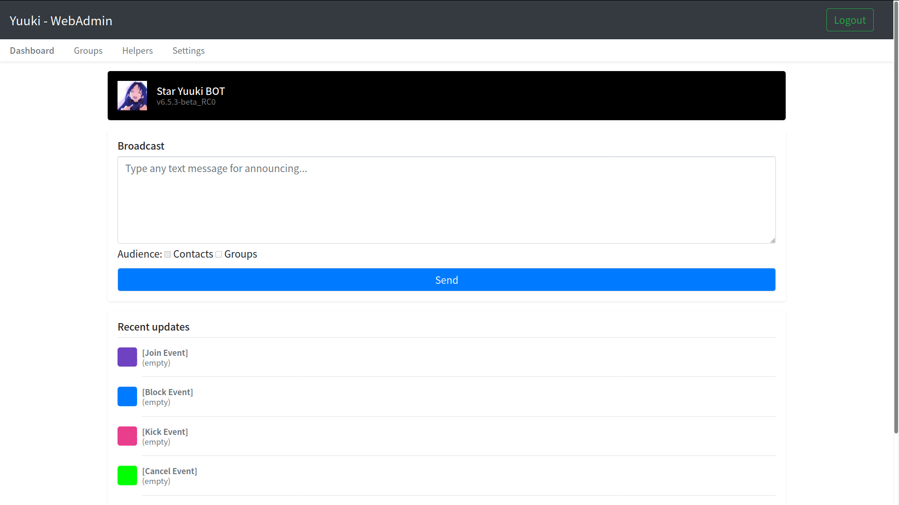

# Star Yuuki(pYthon) BOT - Yuuki

    

  
 

The perfectest LINE Group Protective BOT.

This is the BOT which was the first Chinese LINE Group Security BOT.

Since 2018, it turns to be an opensource software.

## Introduction

This is a LINE Group Security BOT, to solve the problem that prevent from someone who is not the management but trying to destroy the group.

As know as the group feature of LINE has a major issue, everyone own the permission to modify the member list.

It's a good idea to be fair, but causes a communicate risk if one of member kick everyone maliciously.

So a protective solution is necessary, especially for corporation, organization, or education.

Since 2015, we start to design and provide several solutions to the market and public, Star Yuuki BOT is one of the success cases.

To protect Internet Security is our duty, and open source is romantic, that is why we are here.

> This is design to be a complete BOT, don't use the software as a "Self BOT", it might damage your account.

## License

The software is licensed under [Mozilla Public License 2.0](LICENSE.md) with [COPYING.md](COPYING.md).

## Features

It's a powerful software, not only a BOT, even to be you secretary.

| Feature | Status |  Note |
|---|---|---|
| Login for authorizing | X | [Read the document](https://github.com/star-inc/star_yuuki_bot/wiki/Configure) |
| Basic Group Protection | O |
| Specify the Vice Administrators of a Group | O |
| Multiprocessing Support | O |
| Advanced Group Protection | O |
| [WebAdmin](#WebAdmin) | O |
| General [Manual](https://line.starinc.xyz/yuuki_manual/) for Users | O |
| [Documentation](#Documents) for Developers | X | Preparing |
| 100% [OpenSource](https://github.com/star-inc/star_yuuki_bot) and Free | O | [Licensed](#License) |

## WebAdmin

This is a magic feature since `v6.5.3` that you can control your BOT with GUI.

| Feature | Status |  Note |
|---|---|---|
| Broadcast | O | Group Only currently |
| Events Viewer | O |
| Profile Modify | O |
| Groups Management | O |
| Helper Management | O |
| Yuuki Configure | X | Developing |

## Documents

Are you finding how to setup, use, or extend its features? 

The documentation is preparing, will be available on [GitHub Wiki](https://github.com/star-inc/star_yuuki_bot/wiki) as soon as possible.

## Logo Copyright

Copyright of `logo.png` belongs to "[©川原 礫／ASCII Media Works／SAO Project](https://www.aniplex.co.jp)" and its artists.

> (c) 2020 Star Inc.
